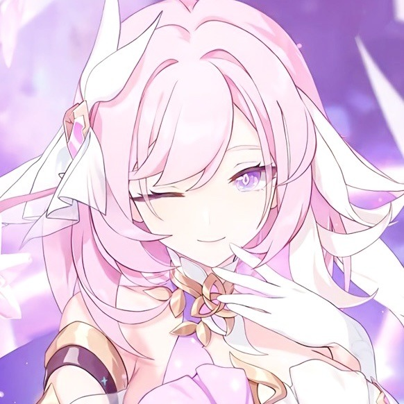

<h1 align="center"> Elysia Discord Chatbot </h1>
<p align="center">

</p>

This chatbot is built using the [Discord.js](https://discord.js.org/) library and utilizes the [Microsoft DialoGPT](https://huggingface.co/microsoft/DialoGPT-medium) conversational model fine-tuned on the character Elysia from the game Honkai Impact.

# Prerequisites

Before you begin, you will need to have the following:

- A Discord account and a Discord server where you have permission to add a bot
- [Node.js](https://nodejs.org/en/) and [npm](https://www.npmjs.com/) installed on your local machine
- A [Hugging Face](https://huggingface.co/) account (free)

# Setting up the bot

1. Clone this repository to your local machine.
2. In the root directory of the project, run `setup.bat` to install the required dependencies.
3. Create a file named .env in the root directory of the project and add the following:
```
DISCORD_TOKEN=[Your Discord bot token]
HUGGINGFACE_TOKEN=[Your Hugging Face API key]
```
You can get a Discord bot token by creating a new bot in the [Discord Developer Portal](https://discord.com/developers/applications).

To get a Hugging Face API key, go to your [account settings](https://huggingface.co/settings/tokens) on the Hugging Face website.

# Running the bot

To run the bot, simply run `run.bat` in the root directory of the project. The bot will connect to the Discord server and will be ready to use.

# Using the bot

To use the bot, make a channel named `elysia` and simply send a message to the channel the bot will respond using the Elysia conversational model.

To edit the channel name that you want the chatbot to talk to, go to `config.json` and edit the `"channelName": "elysia"` to the channel name you want it to chat.

You can change the conversational model in the `config.json` by editing `"modelName": "Jaszii/DialoGPT-Elysia"` to the conversational model you want to use.
```json
{
    "channelName": "elysia",
    "modelName": "Jaszii/DialoGPT-Elysia"
}
```

# References

[Discord.js documentation](https://discord.js.org/)

[Microsoft DialoGPT on Hugging Face](https://huggingface.co/microsoft/DialoGPT-medium)

[How to Build a Discord AI Chatbot that Talks Like Your Favorite Character](https://www.freecodecamp.org/news/discord-ai-chatbot/)

[Jaszii/DialoGPT-Elysia](https://huggingface.co/Jaszii/DialoGPT-Elysia)
